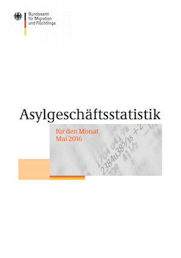
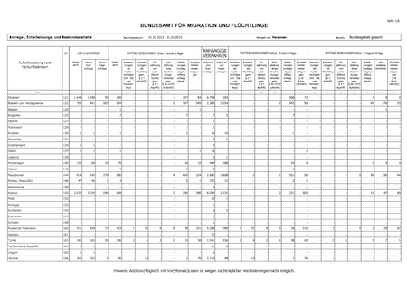

# bamf-asylgeschaeftsstatistik

## Zu den Daten

Das BAMF (Bundesamt für Migration und Flüchtlinge) veröffentlicht monatlich Daten zum Thema Asyl. Das ist eine wichtige und  aktuelle Datenquelle.

In diesem Repository finden sich die Daten aus zwei Quellen:

1. die [monatlich veröffentlichte Asylgeschäftsstatistik](http://www.bamf.de/DE/Infothek/Statistiken/Asylzahlen/Asylgesch%C3%A4ftsstatistik/asylgeschaeftsstatistik-node.html) - Ordner `report`
2. die Rohdaten dahinter - [angefragt über das Informationsfreiheitsgesetz](https://fragdenstaat.de/anfrage/rohdaten-hinter-monatl-asylgeschaftsstatistik/) - Ordner `raw`

Besuche einen der beiden Ordner, um mehr über die Daten zu erfahren und die Daten als CSV zu erhalten.

| [monatlich veröffentlichte Asylgeschäftsstatistik](report/) | [Rohdaten](raw/) |
| --- | --- |
|  |  |

## Zum Projekt
Entstanden auf dem [Refugee Datathon in München](https://refugee-datathon-muc.org)

## Datenchecks
see README.md in cooked data directory

