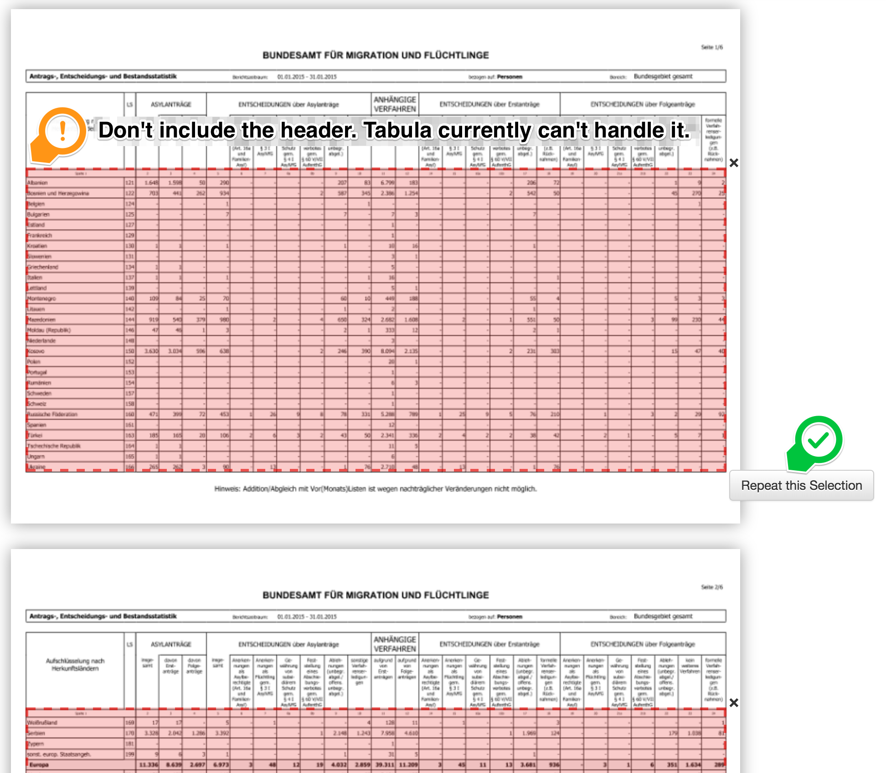
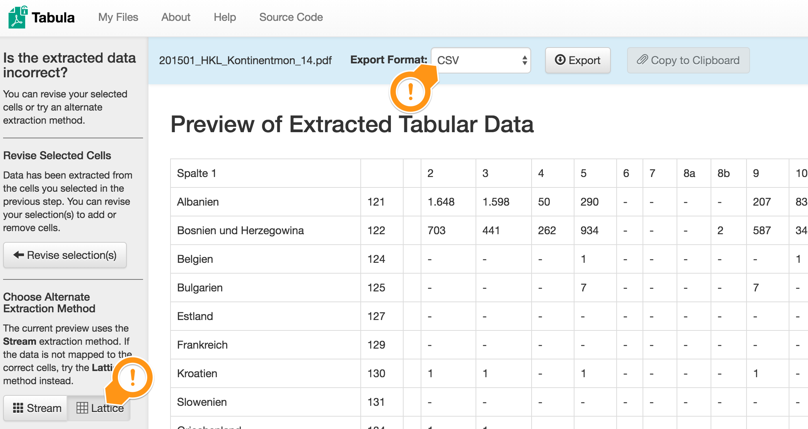

# Rohdaten hinter der monatl. Asylgeschäftsstatistik

Auf dem ersten [Refugee Datathon München](https://refugee-datathon-muc.org) haben wir eine [IFG-Anfrage bei FragDenStaat](https://fragdenstaat.de/anfrage/rohdaten-hinter-monatl-asylgeschaftsstatistik/) an das BAMF (Bundesamt für Migration und Flüchtlinge) gestellt, um die Rohdaten hinter der [monatlich veröffentlichten Asylgeschäftsstatistik](http://www.bamf.de/DE/Infothek/Statistiken/Asylzahlen/Asylgesch%C3%A4ftsstatistik/asylgeschaeftsstatistik-node.html) zu bekommen.
Das BAMF hat uns daraufhin monatliche PDFs bereitgestellt. Seit 2017 veröffentlicht das BAMF diese PDFs auf seiner Website. 

In diesem Repository liegen die CSV-Dateien, die wir aus den PDFs herausziehen, um sie weiterverarbeiten zu können. Wir erstellen daraus beispielsweise Histogramme mit datawrapper. Diese Daten sind öffentlich und jede/r ist willkommen, sie zu nutzen.  

datapackage.json: Möglicherweise veraltete Dokumentation gemäss Datapackage http://dataprotocols.org/data-packages , mit Datapackage bauen: http://datapackagist.okfnlabs.org

## HowTo: CSV aus den PDFs gewinnen

Benötigt:

* monatliche Asylgeschäftsstatistik als PDFs vom [BAMF](https://www.bamf.de/DE/Themen/Statistik/Asylzahlen/AsylGesStatistik/asylgeschaeftsstatistik-node.html)
* [Tabula](http://tabula.technology) Herunterladen, starten, warten, auf http://localhost:8080/ finden. Es braucht java. Starten zB als exe auf Windows. Auf Mac starten mit: /tabula/Tabula.app/Contents/MacOS/JavaAppLauncher

Manuell extrahieren:
1. Importiere eine Monats-PDF in Tabula
2. Markiere nur den Inhalt der Tabelle - nicht den Header (damit kann Tabula nicht umgehen). Nutze _Repeat this Selection_ um alle Seiten mitzunehmen.


3. Klicke auf **Preview & Export Extracted Data**. Stelle dann (links) die **Extraction Method** auf **Lattice**


4. Prüfe, ob die Daten so aussehen wie im Screenshot darüber. Es sollten keine leeren Spalten zwischen den Zahlen existieren.
5. Exportiere als CSV.

Mit Script, im bin-directory dieses git repos stehend:
```
wget "https://www.bamf.de/SharedDocs/Anlagen/DE/Statistik/Asylgeschaeftsstatistik/hkl-antrags-entscheidungs-bestandsstatistik-februar-2020.pdf?__blob=publicationFile&v=3" -O hkl-antrags-entscheidungs-bestandsstatistik-februar-2020.pdf
./tabula.sh hkl-antrags-entscheidungs-bestandsstatistik-februar-2020.pdf 202002.csv
```

6. Kopiere die CSV-Datei als YYYYMM.csv in das YYYY/raw-Verzeichnis.
7. Gehe ins bin-Verzeichnis und rufe auf: `./postprocess_csv.sh ../raw/2017/201710.csv`. Das macht ein paar Bereinigungen und fügt 1. eine Kopfzeile, 2. Jahr und Monat hinzu. 
9. Um die Daten zu einem Land, beispielsweise Pakistan, über die Monate hinweg zu erhalten, rufe auf: `./per_country.sh -c Pakistan -y "2016 2017"`.
10. Um ein Histogramm wie auf https://refugeedatathonmuc.wordpress.com/ zu erzeugen, reduziere die Daten mit `../bin/cut_country.sh ../cooked/Pakistan.csv`. Die resultierende Datei `../cooked/Pakistan_cut.csv` enthält nur die Spalten JahrMonat, Anträge gesamt, positive, negative, sonstige. 
In anderen Worten: `COUNTRY=Eritrea; ./per_country.sh -c $COUNTRY -y "2016 2017"; ./cut_country.sh ../cooked/${COUNTRY}.csv; ../cooked/${COUNTRY}_cut.csv`. Hinweis: Es wird nach dem $COUNTRY gegrept. `COUNTRY=Sierra` für Sierra Leone funktioniert. Für die VR China geht `COUNTRY="China,"`.
Zum Generieren des Histogramms kann man beispielsweise Excel benutzen, wir nehmen [https://app.datawrapper.de].
